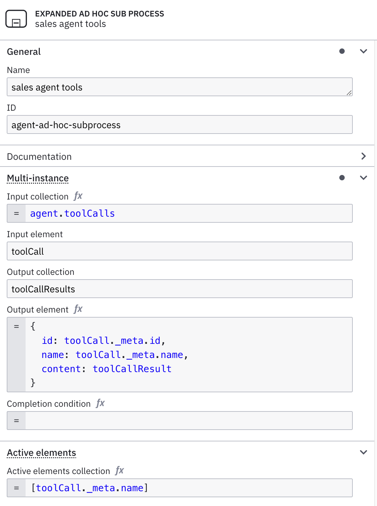
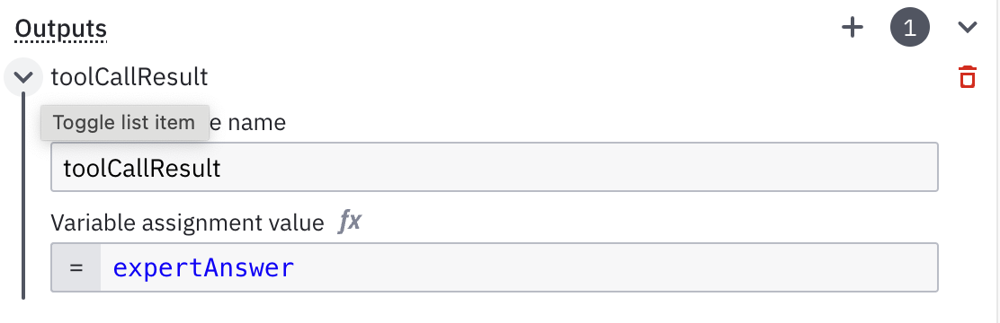
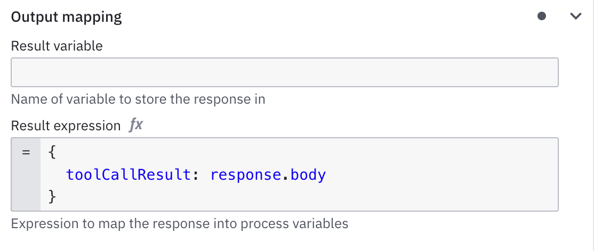
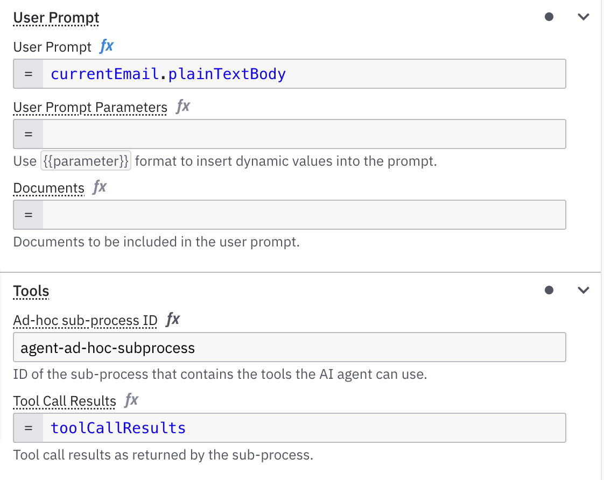
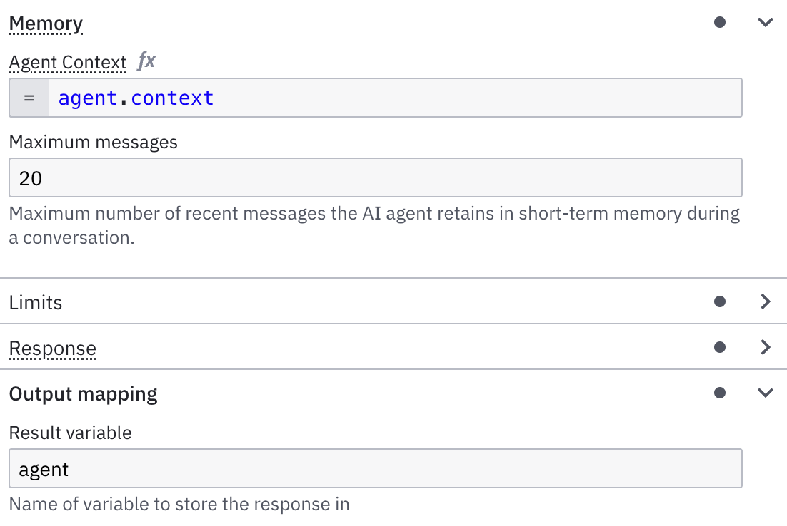

# Agentic AI Lab 

This project demonstrates the basic steps of creating an AI Agent with Camunda.

## Technical pre-requisites
1. Cluster 8.8.0-alpha5
2. GMail account to send emails (or any other email provider that you have access to to send emails)
3. To avoid picking up all unread emails in your inbox create a folder (==label) in your GMail account (must be lower case): ```camundasalesagent```
4. Connector secret: ```GOOGLE_MAIL_USERNAME```
5. Connector secret: ```GOOGLE_MAIL_PASSWORD```
6. OpenAI account with access to gpt-4.1 (gpt-4o never calls the email tool...)  
7. Connector secret: ```OPENAI_API_KEY```

The Google Password is NOT your user password, you must create an application password:
https://myaccount.google.com/u/1/apppasswords

In case you need to enable 2FA before you can follow these steps:
[Turn on 2-step verification - Google Account Help](https://support.google.com/accounts/answer/185839?hl=en)

## Steps to run the agent

### Import the sources
[Click here to import into a WebModeler project](https://modeler.cloud.camunda.io/import/processes?source=https://raw.githubusercontent.com/McAlm/Agentic-AI-Lab/refs/heads/main/Agentic%20AI%20Lab.bpmn,https://raw.githubusercontent.com/McAlm/Agentic-AI-Lab/refs/heads/main/expert.form,https://raw.githubusercontent.com/McAlm/Agentic-AI-Lab/refs/heads/main/README.md)

### Configure the ad-hoc subprocess
The ad-hoc subprocess contains all the tools the agent has access to.
More information on the properties you will find in our [docs](https://docs.camunda.io/docs/next/components/connectors/out-of-the-box-connectors/agentic-ai-aiagent-example/#configure-properties)



### Configure the Output Mapping of the tools
For the tools ```calculate payment amount``` and ```send email``` all configurations are already done.

You only need to configure the output mapping for ```involve expert``` and ```load products```.

#### Involve expert
The configured Camunda form contains a text area referring to a variable ```expertAnswer```. We need to map this to the expected return variable ```toolCallResult```.



#### Load products
This is REST Connector that will call an endpoint to search for products by a given category. Here we want to return the whole response as ```toolCallResult``` so that the AI has access to all product details.


### Configure the AI Task

The AI connector already has a system prompt defined. This can be seen as the "How" and "Why" whereas the user prompt is the actual "What", in our example a dedicated ask for a certain product via email.






## Run the Agent
1. Deploy the process into a 8.8.0-alpha5 cluster
2. Send an email to the configured email address with something like 
```Hi, I am interested in a new grill. What can you offer?```
3. Go to Operate via Console
4. Find your started process instance (it might take a couple of seconds as 1. the email must be delivered and 2. the Email connector needs to pick it up)
5. Observe the instance in Operate and see which tools the agent uses
6. In case of involving an expert open Tasklist (via Console) and enter some expert advise.


